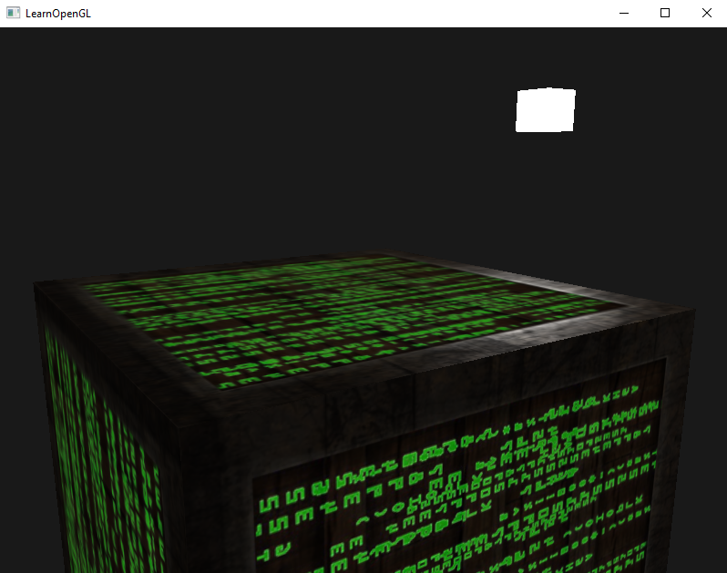
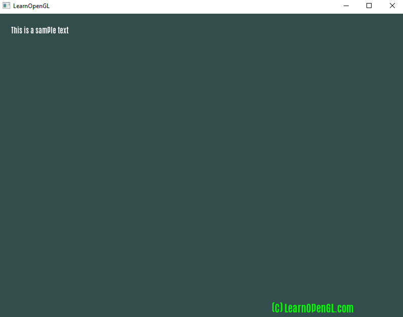
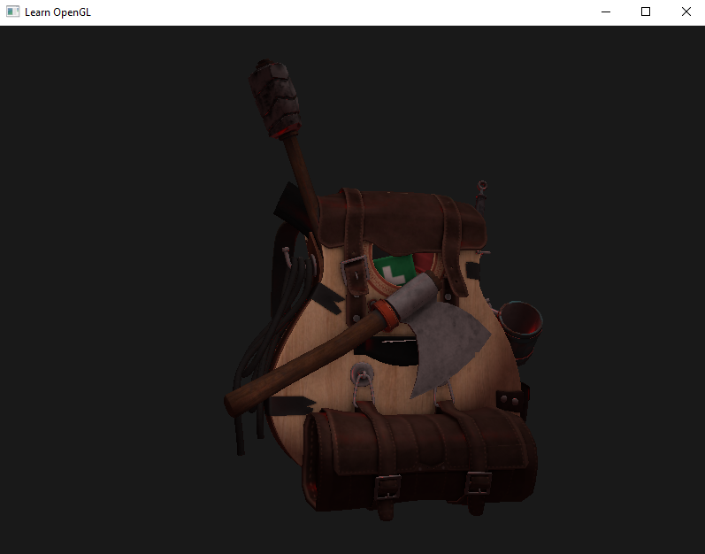

# Learn OpenGL In C, not C++
This code is for those of us who use C instead of C++, for the LearnOpenGL tutorial website.  
  
Original tutorial website here :  
https://learnopengl.com/  

The original github here :  
https://github.com/JoeyDeVries/LearnOpenGL  
  
Their license is the creative common license 4. So I am forced to use that license. 
  
I have converted so far :  
* 1.getting_started 
* 2.lighting 
* 3.model_loading  
* 4.advanced_opengl  
* 7.in_practice
  
# NEWS ABOUT ASSIMP  --- UPDATED April 9th 2022  
  After a lot of trial and error and figuring things out, I soon realized after uninstalling the windows SDK, that the ASSIMP version that LearnOpenGL is using is a DEBUG version. How do I know this ? Because it requires the 2015 runtime libraries, but has the D in the DLL library name. Meaning, he should have compiled assimp as a RELEASE version, NOT a debug version. So the runtime libraries did nothing to resolve the problem. It requires the end user to install the SDK. A HUGE no-no, and it is why so many people are having issues trying to run his version of assimp. Talk about a BONEHEAD mistake! I have tried recompiling ASSIMP, but since it required so many changes, that didn't work with LearnOpenGL's source code, I said "fuck it", and I found an already pre-compiled version of assimp that DOES work. Assimp 3.1.1 works and I am able to use it with GCC ( MinGW ) on windows just fine. Now, for the side news, this assimp 3.1.1 version requires the 2012 runtime libraries. It is also a RELEASE version of assimp. So far, I have had no issues getting this to run. I DID include the 2012 redistributables, just in case you didn't have it.  Just make sure to update your INCLUDE and LIB path to the 3.1.1 version of assimp that I supplied with this project. I kept the old one from LearnOpenGL, just in case you wanted to see for yourself that it is the same one from his github, and that it's the DEBUG version.  Good luck.  
  
**NOTES**  
* Do to the libraries used to get this to work, C99 is the oldest version that you can use. C89 and C90 failed because of those libraries.  
* I tried to stick fairly close to the original author's libraries and folder structures, so that it would be easier to follow along his tutorials.  
* I Finally got text rendering working. It's in the 7.in_practice folder.  
* Over time I hope to add OpenGL 4.5+ code to my github. It just will not be part of this repo.  
* I was finally able to get Assimp working with the help of Nick Wessing's source code. With that I was able to figure out how assimp works. I had never used assimp before. Nick's Github : https://github.com/nwessing/ Also this means I was not using the original shader files that came from LearnOpenGL. However the backpack asset is being used.  Also, the Assimp library supplied here works with codeblocks / mingwx64 ( gcc ). It should work with Visual Studio as well. But I have not tested that.  
  
  
YOUTUBE VIDEO - TRIANGLE  
https://www.youtube.com/watch?v=Hzo3uYei3r0  
  
The code is good enough to learn from, and a lot of the code I hand wrote, to get around the C++ only code.  

The C compiler I use is GCC / MinGW 64-Bit. The version I use is from this link :  
https://nuwen.net/mingw.html  
This version works great on windows. Linux users already have access to GCC.  
  
Make sure to look in the libs folder. That is where I kept all of my 3rd party libraries / code from outside sources. The freetype is compiled for codeblocks. So if you need freetype for visual studio or some other compiler / IDE, then you will need to get a fresh copy of freetype and compile it yourself. You can get freetype from here :  
https://freetype.org/
  

  
EXAMPLE Using C  
  
  
  
  
  
  